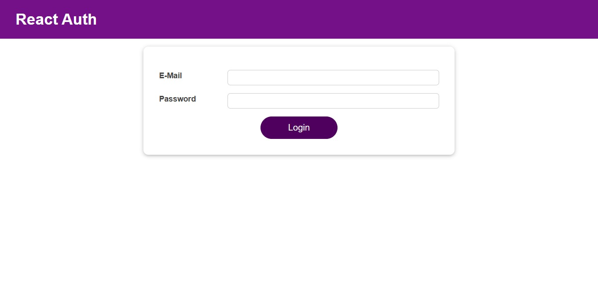
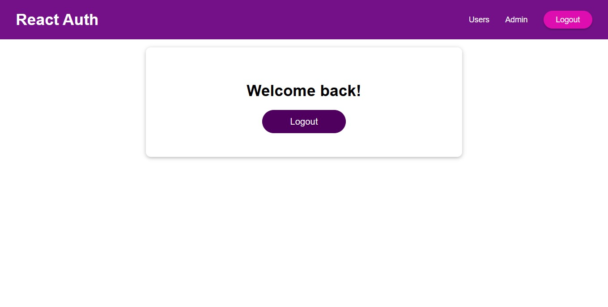

# React Authentication and Navigation App

This is a React application that demonstrates a basic authentication and navigation system. It includes features such as user login, logout, and navigation between different sections of the application based on the authentication status.

## Table of Contents

- [React Authentication and Navigation App](#react-authentication-and-navigation-app)
  - [Table of Contents](#table-of-contents)
  - [Features](#features)
  - [Getting Started](#getting-started)
  - [Preview](#preview)
  - [Contributing](#contributing)
  - [Contact Me](#contact-me)

## Features

- **User Authentication:** Users can log in and log out.
- **Protected Routes:** Certain sections of the application are accessible only to authenticated users.
- **Navigation:** The navigation menu adapts based on the user's authentication status.

## Getting Started

1. **Clone the Repository:**

    ```bash
    git clone https://github.com/Adhamxiii/react-authentication-app.git
    ```

2. **Install Dependencies:**

    ```bash
    cd react-authentication-app
    npm install
    ```

3. **Run the Application:**

    ```bash
    npm start
    ```

    The app will be accessible at [http://localhost:3000](http://localhost:3000).

## Preview

<p float="left">
  
  
</p>

## Contributing

Feel free to contribute to this project. If you find any issues or have suggestions for improvements, please open an issue or create a pull request.

## Contact Me

If you have any questions or suggestions, feel free to contact me:

- GitHub: [Adham Nasser](https://github.com/Adhamxiii)
- Linkedin: [Adham Nasser](https://www.linkedin.com/in/adhamnasser/)
